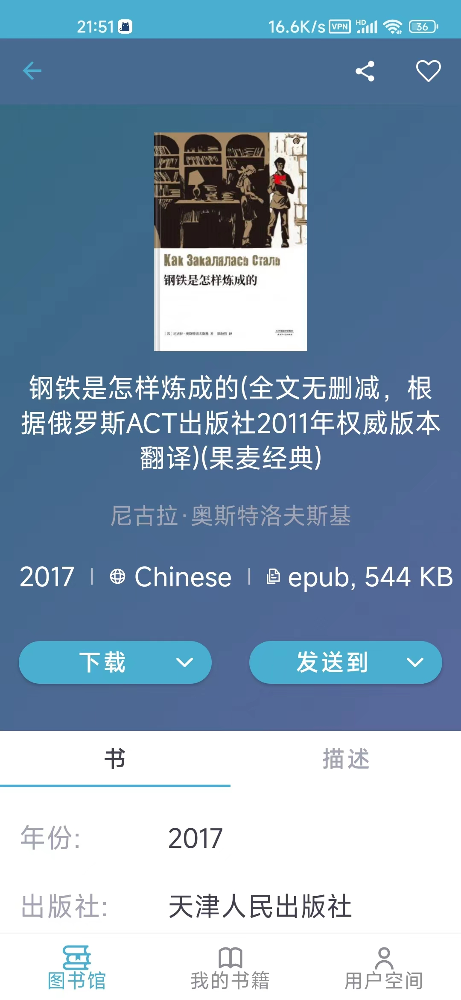

## 介绍

项目用于帮助寻找和共享书籍资源。

## 工具

项目目录里面提供了 Android 版本 ZLibrary，可以直接下载使用，搜索想要的书籍，直接下载即可，如下：

但是，**工具的使用需要翻墙**。

如果有需要寻找的资源，但是没有VPN，也可以提 issue，但是不要滥用 issue，确保提 issue 是你最后的手段，当然有其他的问题也可以提 issue。

## 阅读

pdf 文件阅读器推荐使用 [Sumatra PDF](https://www.sumatrapdfreader.org/free-pdf-reader)，非常的好用，不仅支持 pdf，epub也支持，但是只有 windows 版本的。